# Behavior Tree (AI) System Architecture

This document outlines the architecture of the game's Artificial Intelligence (AI), which is built using a **Behavior Tree (BT)**. The BT is a powerful and flexible way to model complex, hierarchical behaviors for non-player characters (NPCs), such as the Mushroom enemy. It allows for creating sophisticated logic that is both easy to understand and to modify.

The implementation is built on top of the **gdxAI** library's BT module and is fully integrated into the **Fleks** ECS framework.

-----

### Step 1: The Core AI Components

The AI architecture is composed of several key components that work together to bring an enemy to life.

1.  **`BehaviorTreeComponent` (`components/ai/BehaviorTreeComponent.kt`)**
    This is the main Fleks component that attaches an AI to an entity. It is responsible for:

    * Loading the BT logic from an external `.tree` file (e.g., `ai/mushroom.tree`). This allows for changing AI behavior without recompiling the game.
    * Creating and holding the two most important AI objects: the `BehaviorTree` instance and the Blackboard.

2.  **The Blackboard (`ai/blackboards/MushroomContext.kt`)**
    The Blackboard is the AI's "brain" or memory. It acts as a **context object** that gives the Behavior Tree access to the game world and the entity's own components.

    * It holds direct references to the entity's components (`PhysicComponent`, `IntentionComponent`, `HealthComponent`, etc.).
    * It contains high-level methods that Actions and Conditions can call to query the state of the world (e.g., `isPlayerInChaseRange()`) or to make the entity perform an action (e.g., `chasePlayer()`, `patrol()`).
    * The `MushroomContext` is a specific implementation of `AbstractBlackboard` tailored for the Mushroom enemy.

3.  **Sensor Components (`RayHitComponent` & `NearbyEnemiesComponent`)**
    The AI cannot act on information it doesn't have. These components store the data gathered by the AI's "senses":

    * `RayHitComponent`: Stores the results of raycasts performed by the `BasicSensorsSystem`. It tells the AI if it has hit a wall, if there is ground ahead, if it can attack the player, etc.
    * `NearbyEnemiesComponent`: Stores a list of nearby entities detected by a physics sensor.

-----

### Step 2: Behavior Tree Nodes (Actions & Conditions)

The logic of a Behavior Tree is defined by its nodes. Our implementation uses two main types of custom leaf nodes.

1.  **Actions (`ai/core/AbstractAction.kt`)**
    Actions are the "work" nodes of the tree; they make the entity **do** something. Examples include `Chase`, `Patrol`, and `Attack`.

    * They have an `enter()` method for setup, an `onExecute()` method that runs every tick, and an `exit()` method for cleanup.
    * An action's primary job is to change the entity's **intent**. For example, the `Chase` action sets `intentionCmp.wantsToChase = true`. It doesn't move the entity directly; it just signals the *intention* to do so.

2.  **Conditions (`ai/core/AbstractCondition.kt`)**
    Conditions are the "decision" nodes of the tree; they **check** if something is true and return `SUCCESS` or `FAILURE`. Examples include `CanAttack`, `HasPlayerNearby`, and `ShouldChase`.

    * They typically read data from the Blackboard (`MushroomContext`) and sensor components to evaluate the game state.
    * Their success or failure determines which branch of the Behavior Tree is executed.

-----

### Step 3: The AI Systems

Two main systems drive the entire AI process.

1.  **`BasicSensorsSystem.kt`**
    This is the AI's perception system. It runs every frame *before* the BT logic.

    * It performs a series of **Box2D raycasts** from the entity into the environment to gather data.
    * It checks for walls, gaps in the ground, ledges for jumping, and whether the line of sight to the player is clear.
    * It populates the `RayHitComponent` with the results of these checks. This gives the BT up-to-date information about its surroundings to make intelligent decisions.

2.  **`BehaviorTreeSystem.kt`**
    This is the "engine" that executes the AI logic.

    * It iterates through every entity with a `BehaviorTreeComponent`.
    * It simply calls `behaviorTree.step()`, which executes one "tick" of the Behavior Tree. This call causes the tree to be traversed from the root down, checking conditions and executing actions.

-----

## The AI Decision-Making Loop

The entire process, from sensing the world to performing an action, follows a clean, decoupled loop:

1.  **SENSE**: The `BasicSensorsSystem` gathers information about the world via raycasts and populates the `RayHitComponent`.
2.  **THINK**: The `BehaviorTreeSystem` steps the BT. The BT reads the sensor data from its Blackboard and decides on a course of action (e.g., "I should chase the player").
3.  **INTEND**: The chosen Action node (e.g., `Chase`) modifies the entity's `IntentionComponent` (e.g., sets `walkDirection = WalkDirection.RIGHT` and `wantsToChase = true`).
4.  **ACT**: Other, non-AI systems read the `IntentionComponent` and execute the physical action.
    * The `MoveSystem` sees the new `walkDirection` and applies the correct velocity.
    * The `StateSystem` sees the new intentions and transitions the entity's FSM to the appropriate state (e.g., `WALK`).
    * The `AnimationSystem` sees the new FSM state and plays the corresponding animation.

This decoupled approach is powerful because the AI logic (the BT) is only responsible for making decisions, not for executing them. The actual execution is handled by the game's existing physics and rendering systems.

### AI Workflow Diagram

```mermaid
graph TD
    A["<b>Step 1: SENSE</b><br/>BasicSensorsSystem uses raycasts to gather world data"] --> B;
    B["<b>Fills `RayHitComponent`</b><br/>(e.g., wallHit = false, groundHit = true)"] --> C;
    C["<b>Step 2: THINK</b><br/>BehaviorTreeSystem calls `behaviorTree.step()`"] --> D;
    D["<b>BT Traversal</b><br/>- Condition nodes read `RayHitComponent`<br/>- An Action node is selected (e.g., Chase)"] --> E;
    E["<b>Step 3: INTEND</b><br/>Chase action updates the<br/>`IntentionComponent` (e.g., wantsToChase = true)"] --> F;
    F["<b>Step 4: ACT</b><br/>Other systems read the IntentionComponent"] --> G;

    subgraph "Game Systems React"
        F --> F_1["MoveSystem applies velocity"];
        F --> F_2["StateSystem changes FSM state to WALK"];
        F --> F_3["AnimationSystem plays walk animation"];
    end

    G{Enemy physically moves and animates in the world 🤖};
```

