# Finite State Machine (FSM) Architecture

This document outlines the architecture of the game's Finite State Machine (FSM) system. The FSM is a powerful pattern used to manage the behavior and logic of entities, particularly characters like the player and enemies. It ensures that an entity is always in a single, well-defined state (e.g., `IDLE`, `WALK`, `ATTACK`) and handles the transitions between these states in a clean and organized manner.

The implementation is built on top of the **gdxAI** library's FSM module and is integrated into the **Fleks** ECS framework.

-----

### Step 1: The Core Components

The FSM architecture is built upon three fundamental classes that work together.

1.  **`AbstractFSM<C>` (`state/AbstractFSM.kt`)**
    This is the abstract base class for all individual states. Every specific state (like `IDLE` or `JUMP`) inherits from it. It provides:

    * The core state methods required by gdxAI: `enter()`, `update()`, `exit()`, and `onMessage()`.
    * Common helper methods that can be used by any state, such as `isFalling()` and `hasGroundContact()`, which abstract away direct physics checks.

2.  **`AbstractStateContext<C>` (`state/AbstractStateContext.kt`)**
    The "Context" is the **owner** of the state machine. It is the object that the FSM controls. The context is crucial because it acts as a **bridge between the state logic and the entity's components**. It holds direct, lazily-initialized references to all necessary components (`PhysicComponent`, `AnimationComponent`, `IntentionComponent`, etc.).

    * States access the entity's data *through* the context (e.g., `ctx.physicComponent.body.linearVelocity`).
    * It provides high-level helper functions for states to use, like `setAnimation()`, `changeState()`, and `entityIsDead()`.
    * There are specific implementations for different types of entities, such as `PlayerStateContext` and `MushroomStateContext`, which may contain specialized properties or methods.

3.  **`StateComponent` (`components/StateComponent.kt`)**
    This is the Fleks component that attaches a state machine to an entity. It holds an instance of gdxAI's `DefaultStateMachine`. This component is the link that allows the FSM to be managed within the ECS world.

-----

### Step 2: State Implementation (Example: `PlayerFSM.IDLE`)

Each state is defined as a singleton `object` that extends its respective FSM base class (e.g., `PlayerFSM`).

1.  **`enter(ctx)`**: This method is called once when the FSM transitions *into* this state. It's used for setup, such as changing the animation (`ctx.setAnimation(AnimationType.IDLE)`).
2.  **`update(ctx)`**: This method is called **every frame** while the FSM is in this state. This is where the core logic resides. It continuously checks conditions to determine if a state transition is needed.
3.  **`exit(ctx)`**: Called once when the FSM transitions *out of* this state. It's used for cleanup, though often not needed for simple states.
4.  **`onMessage(ctx, telegram)`**: This method allows the state to react to global messages dispatched by the `MessageManager` (e.g., a `PLAYER_IS_HIT` message).

**Example from `main/kotlin/io/bennyoe/state/player/PlayerFSM.kt` (`IDLE` state):**

```kotlin
data object IDLE : PlayerFSM() {
    override fun enter(ctx: PlayerStateContext) {
        // Set animation once on entering
        ctx.setAnimation(AnimationType.IDLE)
    }

    override fun update(ctx: PlayerStateContext) {
        // Check conditions every frame to decide if we should switch state
        when {
            ctx.wantsToJump && hasGroundContact(ctx) -> ctx.changeState(JUMP)
            ctx.wantsToWalk -> ctx.changeState(WALK)
            ctx.wantsToAttack -> ctx.changeState(ATTACK_1)
            isFalling(ctx) -> ctx.changeState(FALL)
        }
    }
}
```

-----

### Step 3: Driving the FSMs (`StateSystem.kt`)

The `StateSystem` is the engine that makes all the FSMs run. It's a simple but vital system.

1.  It iterates through every entity that has a `StateComponent`.
2.  In its `onTickEntity` method, it calls `stateMachine.update()` for each entity.
3.  This single call triggers the `update()` method of the FSM's **current state**, executing its logic and allowing it to check for transitions.
4.  It also updates the `GdxAI.getTimepiece()`, which is essential for any time-based logic within states or AI tasks.

-----

### Step 4: Global States and Messaging

The FSM architecture also supports more advanced concepts for handling overarching logic.

1.  **Global State**: A global state (e.g., `PlayerCheckAliveState`) runs its `update()` method *in addition to* the current state's `update()`. This is perfect for handling logic that should always be active, regardless of the entity's specific state. In this project, it's used to constantly check if the entity's health has dropped to zero, allowing it to transition to the `DEATH` state from anywhere.

2.  **Messaging (`onMessage`)**: States can react to broadcasted messages. For example, the `DamageSystem` dispatches a `PLAYER_IS_HIT` message when the player takes damage. The player's FSM listens for this message, and its `onMessage` implementation will force a transition to the `HIT` state, interrupting whatever the player was doing.

-----

## FSM Workflow Diagram

```mermaid
graph TD
    A["<b>Input/Event Occurs</b><br/>(e.g., Player presses jump key, takes damage)"] --> B;
    B["<b>Input/Damage System</b><br/>- InputSystem sets `intentionCmp.wantsToJump = true`<br/>- DamageSystem dispatches `PLAYER_IS_HIT` message"] --> C;
    C["<b>StateSystem</b><br/>Calls `stateMachine.update()` on the entity"] --> D;
    D["<b>Current State's `update()` or `onMessage()`</b><br/>- `IDLE.update()` checks `ctx.wantsToJump`<br/>- `onMessage()` receives telegram"] --> E;
    E["<b>Transition Logic</b><br/>State decides to change: `ctx.changeState(JUMP)`"] --> F;
    F["<b>New State's `enter()` Method</b><br/>`JUMP.enter()` is called"] --> G;
    G["<b>Action is Performed</b><br/>`ctx.setAnimation(AnimationType.JUMP)`<br/>`ctx.jumpComponent.wantsToJump = true`"] --> H{Visual & logical change happens in-game! 🚀};
```


