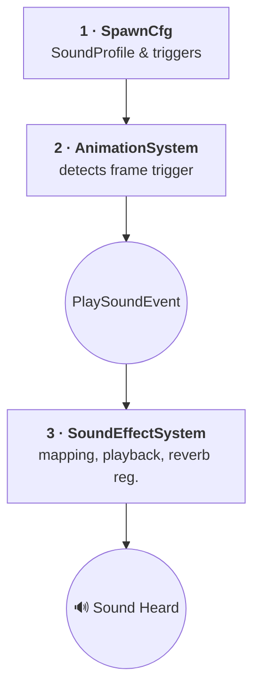

# Sound System Architecture

This document outlines the architecture of the game's sound system. It is a robust, **event-driven** system designed for flexibility and easy management of all audio aspects, from entity-specific sounds to environmental audio.

```
mermaid
graph TD
    A[AnimationSystem] -- fires --> B((PlaySoundEvent))
    B --> SFX[SoundEffectSystem]
    A -- fires --> C((PlayLoopingSoundEvent))
    C --> SFX
    A -- fires --> D((StopLoopingSoundEvent))
    D --> SFX
    MapChangedEvent --> MUS[MusicSystem]
    AmbienceChangeEvent --> AMB[AmbienceSystem]
    PlayerZoneContact --> REV[ReverbSystem]
    SFX -- register / unregister --> REV
```

| System                | Core Responsibility (single sentence)                                                  |
|-----------------------|----------------------------------------------------------------------------------------|
| **SoundEffectSystem** | Play _one‑shot_ & looping SFX, update listener position, register sources with reverb. |
| **MusicSystem**       | Stream background / chase / death music and cross‑fade on `GameMood` changes.          |
| **AmbienceSystem**    | Loop environmental ambience playlists and cross‑fade when the map changes.             |
| **ReverbSystem**      | Attach OpenAL EAX reverb presets based on **Reverb Zones** and manage tail effects.     |

---

## 1 · Configuration (`SpawnCfg.kt`)

*Identical to the previous design.*

Each entity declares

| Item              | Purpose                                                                        |
|-------------------|--------------------------------------------------------------------------------|
| `SoundProfile`    | Maps logical `SoundType`s to concrete asset files (surface‑aware if required). |
| `soundTrigger`    | Links `AnimationType` + frame → `SoundType` to decide **when** a sound plays.  |

```kotlin
soundTrigger = mapOf(
    AnimationType.WALK to mapOf(
        3 to SoundType.DAWN_FOOTSTEPS,
        6 to SoundType.DAWN_FOOTSTEPS,
    )
)
```

---

## 2 · Triggering (`AnimationSystem.kt`)

On each frame change the `AnimationSystem`

1. checks `soundTrigger`,  
2. and fires a `PlaySoundEvent` containing `soundType`, world `position`, volume etc.

```kotlin
stage.fire(
    PlaySoundEvent(entity, soundType, volume = 1f, position = objectCenter)
)
```

---

## 3 · Specialised Audio Systems

### 3.1 SoundEffectSystem

* **Listens to:** `PlaySoundEvent`, `PlayLoopingSoundEvent`, `StopLoopingSoundEvent`, `StreamSoundEvent`  
* **Does:**  
  - Retrieves buffers from `AssetStorage`.  
  - Creates `BufferedSoundSource`s (one‑shot) or re‑uses/creates looping sources.  
  - Sets 3D position & attenuation.  
  - Registers every active source with `ReverbSystem`.  
  - Cleans up finished one‑shot sources each tick.  
  - Updates the **listener** position (player’s `prevPos`) each tick.

### 3.2 MusicSystem

* **Listens to:** `MapChangedEvent` (reads map properties like `bgMusic`),  
  and polls `GameStateComponent.gameMood` each tick.  
* **Does:**  
  - Streams large tracks with `StreamedSoundSource`.  
  - Keeps three playlists (`bg`, `chase`, `dead`) in a `ThemePlayListProvider`.  
  - Cross‑fades via `JukeBox.softStopAndResume()` when the theme id changes.

### 3.3 AmbienceSystem

* **Listens to:** `MapChangedEvent` (build ambience playlists) and  
  `AmbienceChangeEvent` (switch theme).  
* **Does:**  
  - Creates a playlist per `AmbienceType` (e.g. **CAVE**, **FOREST**).  
  - Cross‑fades ambience with its own dedicated `JukeBox`.

### 3.4 ReverbSystem

* **Listens to:** Player’s `ReverbZoneContactComponent`.  
* **Public API:** `registerSource(src)` / `unregisterSource(src)` used by `SoundEffectSystem`.  
* **Does:**  
  - Loads preset via `ReverbService.getReverb(presetName)`.  
  - Attaches effect to *all* registered sources when entering a zone.  
  - Updates wet/dry mix while inside a zone.  
  - Moves old effect into a `TailReverb` list when leaving the zone, detaching after decay.

---

## 4 · Sound Mapping (`SoundMappingService.kt`)

Unchanged: maps `SoundType` → asset file based on `SoundProfile` + optional `FloorType`.

---

## 5 · Playback Details (TuningFork)

```kotlin
val buffer = assetStorage.get<SoundBuffer>(soundAsset.path)
val source = audioEngine.obtainBufferedSource()
source.buffer = buffer
source.position = position ?: Vector3.Zero
source.play()
```

* Playback code now lives **inside each system** (usually SoundEffectSystem).

---

## 6 · Music & Ambience Playlists

| System          | JukeBox       | Theme Selector                         | Typical Volume |
|-----------------|---------------|----------------------------------------|----------------|
| `MusicSystem`   | `musicJukebox`| `GameStateComponent.gameMood`          | 0.3 – 0.6      |
| `AmbienceSystem`| `ambienceJukebox` | `AmbienceChangeEvent.type`         | per playlist   |

```kotlin
if (musicPlayListProvider.theme != newTheme) {
    musicPlayListProvider.theme = newTheme
    musicJukebox.softStopAndResume(Interpolation.linear, 1f)
}
```

---

## 7 · Environmental Reverb Zones

Handled entirely by **ReverbSystem**:

```kotlin
val newFx = getReverb(zone.presetName)
attachEffectToAllSources(newFx, wet = zone.intensity)
```

* Tail effects are kept for `REVERB_TAIL_SEC` seconds to avoid abrupt cut‑offs.  
* New sources created inside a zone receive the effect automatically via `registerSource()`.

---

## 8 · Looping & Streamed Sounds

| Event Type                 | Purpose                                         | Note                                  |
|----------------------------|-------------------------------------------------|---------------------------------------|
| `PlayLoopingSoundEvent`    | Starts / updates a looping `BufferedSoundSource`| One instance per `SoundType`.         |
| `StopLoopingSoundEvent`    | Stops and frees a looping source                |                                       |
| `StreamSoundEvent`         | Plays large, non‑buffered sounds                | Uses `StreamedSoundSource`.           |

All three are consumed by **SoundEffectSystem**.

---

## 9 · Resource Lifecycle & Disposal

| System            | Disposal Action                                                    |
|-------------------|--------------------------------------------------------------------|
| SoundEffectSystem | Free finished one‑shot & looping sources, unregister from reverb.  |
| MusicSystem       | Dispose its three streamed sources + jukebox on world dispose.     |
| AmbienceSystem    | Dispose ambience playlists + jukebox.                              |
| ReverbSystem      | Detach & dispose active effect, clean tail reverbs, clear sources. |

---

## 10 · Component & Event Reference (Quick Table)

| Name                          | Kind       | Used By / Purpose                                             |
|-------------------------------|------------|----------------------------------------------------------------|
| `AudioComponent`              | Component  | Entity‑attached looping/world sounds (consumed by SFX system). |
| `SoundProfileComponent`       | Component  | Provides per‑entity profiles for mapping.                      |
| `AmbienceSoundComponent`      | Component  | Declares looping ambience entities (handled by AmbienceSystem).|
| `ReverbZoneContactComponent`  | Component  | Player’s active reverb zone (consumed by ReverbSystem).        |
| `PlaySoundEvent`              | Event      | One‑shot positional SFX.                                       |
| `PlayLoopingSoundEvent`       | Event      | Start / update looping SFX.                                    |
| `StopLoopingSoundEvent`       | Event      | Stop looping SFX.                                              |
| `StreamSoundEvent`            | Event      | Large streamed sounds (thunder, voice‑overs).                  |
| `AmbienceChangeEvent`         | Event      | Change ambience theme.                                         |
| `MapChangedEvent`             | Event      | Load playlists & music for new map.                            |

---

## 11 · Best Practices

* **Pitch variance** (`MIN_PITCH…MAX_PITCH`) for repetitive sounds.  
* Stage volumes: **music < ambience < SFX** (`‑10 LU → ‑8 LU → ‑6 LU`).  
* Call `StopLoopingSoundEvent` before deleting an entity.  
* Keep ambience loops ≤ 120 seconds; let `JukeBox` handle cross‑fades.  
* Use `audio_debug` overlay (<kbd>F5</kbd>) to validate attenuation zones.

---

## 12 · Updated Workflow Diagram



*Specialised events (`MapChangedEvent`, `AmbienceChangeEvent`, zone contacts) follow similar pipelines to their respective systems.*

---
