# Sound System Architecture

This document outlines the architecture of the game's sound system. It is a robust, **event-driven** system designed for flexibility and easy management of all audio aspects, from entity-specific sounds to environmental audio.

The core principle is that game systems (like the `AnimationSystem`) do not play sounds directly. Instead, they fire **events** to request a sound, and a central `AudioSystem` handles the logic of selecting and playing the correct audio file.

-----

## Step 1: Configuration (`SpawnCfg.kt`)

The foundation of any entity's sound capabilities is laid out in its spawn configuration. This is where we define *what* sounds an entity can make and *when* it makes them.

1.  **`SoundProfile`**: Each entity is assigned a `SoundProfile`. This profile acts as a map, linking logical `SoundType` enums (e.g., `DAWN_FOOTSTEPS`, `HIT`) to specific `SoundAssets` audio files (e.g., `DAWN_FOOTSTEPS_WOOD.mp3`). The profile distinguishes between simple sounds and context-dependent ones, such as footstep sounds that change based on the surface (`FloorType`).

2.  **`soundTrigger`**: This map defines the exact moment a sound should be triggered within an animation. It links an `AnimationType` and a specific frame index to a `SoundType`. For example, the player's walking animation is configured to trigger a footstep sound on frames 3 and 6.

**Example from `main/kotlin/io/bennyoe/config/SpawnCfg.kt`:**

```kotlin
// ... for "playerStart" entity
SpawnCfg(
    // ...
    soundTrigger =
        mapOf(
            AnimationType.WALK to
                mapOf(
                    3 to SoundType.DAWN_FOOTSTEPS, // On frame 3...
                    6 to SoundType.DAWN_FOOTSTEPS, // ...and 6, trigger a footstep.
                ),
        ),
    soundProfile =
        SoundProfile(
            // ...
            // Maps floor types to specific footstep sound files
            footstepsSounds =
                mapOf(
                    FloorType.WOOD to SoundAssets.DAWN_FOOTSTEPS_WOOD,
                    FloorType.STONE to SoundAssets.DAWN_FOOTSTEPS_STONE,
                ),
        ),
)
```

-----

## Step 2: Triggering (`AnimationSystem.kt`)

As the game runs, the `AnimationSystem` is responsible for updating all entity animations frame by frame.

1.  When the system detects a frame change in an animation, it checks if a `soundTrigger` exists for that new frame in the entity's configuration.
2.  If a trigger is found, the `AnimationSystem` fires a `PlaySoundEvent`. This event is a data package containing all necessary information: the entity that made the sound, the logical `SoundType`, volume, the current `FloorType`, and—crucially for 3D audio—the precise world position where the sound originates.

**Example from `main/kotlin/io/bennyoe/systems/AnimationSystem.kt`:**

```kotlin
// ... calculate objectCenter position ...

stage.fire(
    PlaySoundEvent(
        entity,
        soundType = soundType,
        volume = 1f,
        position = if (soundType.positional) objectCenter else null, // Position for 3D audio
        floorType = pCmp.floorType, // Current ground surface type
    ),
)
```

-----

## Step 3: Central Hub (`AudioSystem.kt`)

The `AudioSystem` is the heart of the sound logic. It constantly "listens" for any audio-related events fired within the game.

1.  **Event Handling**: The system is registered as an `EventListener` and handles events like `PlaySoundEvent`, `PlayLoopingSoundEvent`, and `StopLoopingSoundEvent`.
2.  **Listener Position**: In its `onTick` method, the `AudioSystem` continually updates the position of the audio **listener** (which is always the player). It uses the player's position from the *previous* frame (`playerPhysicCmp.prevPos`) to ensure perfect synchronization with the sound event, which was triggered *before* the current frame's physics update. This prevents audio panning issues.

-----

## Step 4: Mapping (`SoundMappingService.kt`)

Once the `AudioSystem` receives a `PlaySoundEvent`, it needs to determine which specific audio file to play. It delegates this task to the `SoundMappingService`.

1.  This service takes the logical `SoundType` (e.g., `DAWN_FOOTSTEPS`), the entity's `SoundProfile`, and the `FloorType` as input.
2.  It looks up the correct `SoundAssets` file in the provided `SoundProfile`. If the `SoundType` is surface-dependent (`isSurfaceDependent = true`), it uses the `footstepsSounds` map; otherwise, it uses the `simpleSounds` map.

**Example from `main/kotlin/io/bennyoe/service/SoundMappingService.kt`:**

```kotlin
fun getSoundAsset(
    type: SoundType,
    profile: SoundProfile?,
    floorType: FloorType? = null,
): SoundAssets? {
    // ...
    return if (type.isSurfaceDependent) {
        // Look in the footstepsSounds map
        profile.footstepsSounds[floorType] ?: profile.footstepsSounds.values.first()
    } else {
        // Look in the simpleSounds map
        profile.simpleSounds[type]
    }
}
```

-----

## Step 5: Playback (with TuningFork)

With the correct audio file identified, the `AudioSystem` handles the final playback using the **TuningFork** library.

1.  **Get Sound Buffer**: It retrieves the pre-loaded `SoundBuffer` from the `AssetStorage`.
2.  **Obtain Source**: It gets a `BufferedSoundSource` from the audio engine.
3.  **Set Properties**: It configures the source with all properties from the event: volume, 3D position (if positional), looping status, pitch variation, etc.
4.  **Play**: It calls `source.play()` to play the sound, which is now audible in the game at the correct position and time.

-----
---
## Additional AudioSystem Details

### 6. Music & Ambience Playlists (`JukeBox`)
The `AudioSystem` owns two independent **TuningFork JukeBox** instances: one for **background / mood music** and one for **environmental ambience**.

| JukeBox | Theme source | Trigger                             | Volume |
|---------|--------------|--------------------------------------|--------|
| `musicJukebox`    | `GameStateComponent.gameMood` (via `musicPlayListProvider`) | Updated every frame in `onTick()` | `0.3 – 0.6` (soft-faded) |
| `ambienceJukebox` | `AmbienceChangeEvent` carrying an `AmbienceType` | Emitted by map logic / physics when the player enters a new ambience zone | Configured per‐playlist |

```kotlin
// Switching music when game mood changes
val newTheme = when (gameStateCmp.gameMood) {
    GameMood.CHASE       -> GameMood.CHASE.ordinal
    GameMood.PLAYER_DEAD -> GameMood.PLAYER_DEAD.ordinal
    else                 -> GameMood.NORMAL.ordinal
}
if (musicPlayListProvider.theme != newTheme) {
    musicPlayListProvider.theme = newTheme
    musicJukebox.softStopAndResume(Interpolation.linear, 1f)
}
```

**How to add new tracks**

1. Add an `mp3/ogg` file to your assets folder.
2. Expose its path as a **Tiled™ map property** (`bgMusic`, `chaseMusic`, `deadMusic`, …) _or_ emit a dedicated `AmbienceChangeEvent`.
3. The system will create a `StreamedSoundSource`, wrap it in a `Song`, and push it onto the corresponding `PlayList`.

---

### 7. Environmental Reverb Zones
When the player overlaps a map object tagged with a `reverb="arena"` Tiled property, a **preset OpenAL EAX effect** is created and attached to _all currently playing sources_:

```kotlin
val newEffect = getReverb(zone.presetName)
attachEffectToAllSources(newEffect, wet = zone.intensity)
```

* When the player leaves the zone the effect is **detached gradually**:  
  `TailReverb` keeps the effect alive for `REVERB_TAIL` seconds so the decay sounds natural.
* New sources spawned while inside the zone automatically inherit the effect via `applyReverbToNewSource`.

> **Tip:** Keep zone polygons tight around enclosed spaces (caves, halls) to avoid abrupt wet/dry jumps.

---

### 8. Looping & Streamed Sounds
| Event | Purpose | Notes |
|-------|---------|-------|
| `PlayLoopingSoundEvent`   | Starts a **looping** `BufferedSoundSource` (e.g. engine hum). | Duplicate requests for the same `SoundType` are ignored. |
| `StopLoopingSoundEvent`   | Stops and frees a looping source tracked in `loopingSounds`. | |
| `StreamSoundEvent`        | Fires a **one-shot or positional stream** (e.g. thunder clap). | Uses a `StreamedSoundSource` so large files do not block RAM. |

All three share the same argument structure: `sound`, `volume`, and an optional `position` for spatialisation.

---

### 9. Resource Lifecycle & Disposal
* **One-shot sources** are stored in `oneShotSoundSources` and are freed automatically once `!source.isPlaying`.
* **Looping sources** live in `loopingSounds`; always pair a `PlayLoopingSoundEvent` with `StopLoopingSoundEvent`.
* On `AudioSystem.onDispose()` every source, effect and jukebox is **explicitly disposed** to prevent OpenAL leaks.

---

### 10. Component & Event Reference

| Name | Type | Key Fields | Used By |
|------|------|-----------|---------|
| `AudioComponent`              | component | `soundType`, `volume`, `isLooping`, attenuation params | Authoring looping/world sounds directly on entities |
| `SoundProfileComponent`       | component | `profile: SoundProfile` | Allows per-entity overrides for `SoundMappingService` |
| `AmbienceSoundComponent`      | component | `sound`, `type: AmbienceType`, `volume` | Map entities that define looping ambience tracks |
| `ReverbZoneContactComponent`  | component | `activeZone` (polygon, `presetName`, `intensity`) | Tracks current environmental reverb |
| `PlaySoundEvent`              | event     | `soundType`, `position`, `floorType`, `volume` | Usual one-shot SFX |
| `PlayLoopingSoundEvent`       | event     | `soundType`, `volume`, `floorType?` | Long-running loops |
| `StopLoopingSoundEvent`       | event     | `loopId: SoundType` | Stops loop |
| `StreamSoundEvent`            | event     | `sound`, `position?`, `volume` | Large streamed sounds |
| `AmbienceChangeEvent`         | event     | `type: AmbienceType` | Switches ambience playlist |
| `MapChangedEvent`             | event     | `map` (Tiled map) | Reloads playlists & clears ambience |

---

### 11. Best Practices & Tuning Tips
* **Pitch variance** (`MIN_PITCH…MAX_PITCH`) breathes life into frequent sounds (footsteps, impacts).
* **Volume staging:** `music < ambience < SFX`, roughly `-10 LU → -8 LU → -6 LU`.
* Always call `StopLoopingSoundEvent` _before_ removing an entity to prevent dangling OpenAL sources.
* Prefer **surface-dependent** `SoundType`s for footsteps; fall back asset is chosen automatically.
* Keep long ambience loops to ≤ 2 minutes; cross-fades are managed by `JukeBox.softStopAndResume()`.
* Validate attenuation distances in-game with the `audio_debug` overlay (toggle with <kbd>F5</kbd>).

---

## Workflow Diagram

```mermaid
graph TD
    A["<b>Step 1: Config (SpawnCfg.kt)</b><br/>Define SoundProfile & soundTriggers for an entity"] --> B;
    B["<b>Step 2: AnimationSystem</b><br/>Detects an animation frame with a trigger"] --> C;
    C["<b>Fires PlaySoundEvent</b><br/>Contains SoundType, Position, FloorType"] --> D;
    D["<b>Step 3: AudioSystem</b><br/>Receives the event"] --> E;
    E["<b>Step 4: SoundMappingService</b><br/>Which audio file should be played?"] --> F;
    F["Returns the correct SoundAssets file"] --> G;
    G["<b>Step 5: AudioSystem (TuningFork)</b><br/>Configures and plays the final sound"] --> H{Sound is Heard! 🔊};
```


