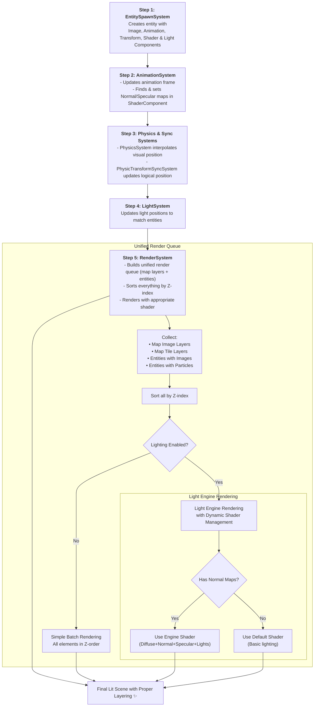

# Graphics, Animation, and Lighting Pipeline

This document outlines the architecture of the game's rendering pipeline. The system is designed to handle complex scenes with animated characters, normal and specular mapping for realistic lighting, and dynamic light sources, all integrated within the Fleks ECS framework.

The core of the system is the `RenderSystem`, which orchestrates the final drawing process using a **unified render queue** that sorts all renderable elements (map layers and entities) by their Z-index for proper layering.

-----

### Step 1: Spawning & Configuration (`EntitySpawnSystem.kt`)

Every visual object in the game world starts as an entity created by the `EntitySpawnSystem`. This system reads data from the game map or other sources and constructs entities by adding a specific set of components.

1.  **Entity Creation**: Entities are typically spawned based on `MapObject` definitions from a Tiled map.
2.  **Configuration (`SpawnCfg`)**: A `SpawnCfg` object provides a template for creating a specific type of entity (e.g., "playerStart", "enemy").
3.  **Core Visual Components**:
    * `ImageComponent`: Holds the `Image` actor that will be drawn on the stage. It also defines the entity's size, scale, and Z-index for layering.
    * `AnimationComponent`: Manages the entity's current animation state, including the active animation, playback mode, and speed.
    * `TransformComponent`: Stores the entity's logical position and dimensions, which are synced with the physics system.
    * `PhysicComponent`: A Box2D body that gives the entity a physical presence in the world.
    * `ShaderRenderingComponent`: Contains texture regions for diffuse, normal, and specular maps when populated by the AnimationSystem. When present, enables advanced lighting effects in the RenderSystem.
    * `LightComponent`: Attaches a `GameLight` (e.g., a `PointLight` or `SpotLight`) from the `gdx-normal-light` engine to the entity.

**Example from `main/kotlin/io/bennyoe/systems/EntitySpawnSystem.kt`:**

```kotlin
// In the createEntity function...
world.entity {
    // ... add ImageComponent, PhysicComponent, etc.
    
    // Add an animation manager
    val animation = AnimationComponent()
    animation.animationModel = cfg.animationModel
    it += animation

    // Enable advanced rendering by adding this component
    it += ShaderRenderingComponent()

    // Attach a light source
    it += LightComponent(the_light_object)
}
```

-----

### Step 2: The Animation System (`AnimationSystem.kt`)

This system is responsible for bringing entities to life by updating their animations every frame.

1.  **Frame Advancement**: It iterates through all entities with an `AnimationComponent` and `ImageComponent`. It advances the animation `stateTime` based on the frame `deltaTime`.
2.  **Texture Update**: It retrieves the correct `TextureRegionDrawable` for the current `stateTime` from a cached `Animation` object. This drawable is then assigned to the entity's `ImageComponent`, updating what is about to be rendered.
3.  **Normal & Specular Mapping**: This is a critical step for lighting. If the entity has a `ShaderRenderingComponent`, the `AnimationSystem` performs an additional lookup. Based on the file name and index of the current diffuse (color) texture, it finds the corresponding normal map and specular map textures in separate `TextureAtlas` files. These texture regions are then stored in the `ShaderRenderingComponent` for the `RenderSystem` to use.

-----

### Step 3: Physics & Transform Sync

To ensure visuals and physics are perfectly aligned, two systems work together.

1.  **`PhysicsSystem.kt`**: This system advances the Box2D physics world. For rendering, its most important job is in the `onAlphaEntity` method, where it **interpolates** the visual position of the `ImageComponent` between its position in the previous physics step and the current one. This prevents visual stuttering.
2.  **`PhysicTransformSyncSystem.kt`**: After the physics step is complete, this system updates the logical `TransformComponent` with the new, final position from the `PhysicComponent`'s body. This ensures other systems have access to the most up-to-date logical position.

-----

### Step 4: The Lighting System (`LightSystem.kt` & `PlayerLightSystem.kt`)

This system manages the dynamic lights in the scene.

1.  **Light Positioning (`LightSystem`)**: Iterates over entities with a `LightComponent` and `PhysicComponent`. It updates the position of the attached light source to match the entity's physics body position every frame.
2.  **Player-Specific Logic (`PlayerLightSystem`)**: This is a specialized system that handles the player's flashlight. It checks the player's `flipImage` property and adjusts the `SpotLight`'s direction accordingly, so the light always points where the player is facing.

-----

### Step 5: The Unified Rendering System (`RenderSystem.kt`)

This is the final and most complex system in the pipeline, responsible for drawing everything to the screen using a unified approach that handles both map layers and entities together.

#### **Key Architecture Changes:**

1.  **Unified Render Queue**: Instead of separate rendering passes, the system now builds a single `renderQueue` containing all renderable elements:
    * **Map Image Layers**: Background images and static elements from Tiled maps
    * **Map Tile Layers**: Tilemap layers with their collision and visual data
    * **Entities with ImageComponent**: Animated characters, objects, and sprites
    * **Entities with ParticleComponent**: Particle effects and systems

2.  **Z-Index Based Sorting**: All elements in the render queue are sorted by their `zIndex` property, ensuring proper layering regardless of whether they're map elements or entities. Map layers get their zIndex from Tiled map properties, while entities use their `ImageComponent.zIndex`.

#### **Rendering Process:**

1.  **Entity Transform Update**: The `onTickEntity` method updates all entity positions and sizes, ensuring physics interpolation is applied for smooth movement.

2.  **Render Queue Building**: The `buildRenderQueue()` method collects all renderable elements:
   ```kotlin
   // Map layers get zIndex from Tiled properties
   val zIndex = layer.properties.get("zIndex", Int::class.java) ?: defaultValue
   
   // Entities use their ImageComponent zIndex
   renderQueue.add(RenderableElement.EntityWithImage(entity, imageCmp, imageCmp.zIndex))
   ```

3.  **Dual Rendering Paths**: Based on the `GameStateComponent.isLightingEnabled` flag:

#### **Without Lighting (`renderWithoutLighting()`):**
- Simple batch rendering in Z-order
- Direct drawing of all elements using `stage.batch`
- Efficient for scenes without advanced lighting needs

#### **With Lighting (`renderWithLighting()`):**
- Uses the `Scene2dLightEngine` for advanced lighting calculations
- **Dynamic Shader Management**: The system intelligently switches between two shaders:
    * **Engine Shader**: For entities with normal/specular maps (`ShaderRenderingComponent` populated)
    * **Default Shader**: For standard sprites, map layers, and particles
- **Shader State Tracking**: Minimizes expensive shader switches by tracking the current shader state
- **Advanced Lighting Effects**:
    * Entities with populated `ShaderRenderingComponent` are drawn using `lightEngine.draw()` with diffuse, normal, and specular textures
    * Standard entities fall back to default rendering but still receive basic lighting

#### **Renderable Element Types:**
```kotlin
sealed class RenderableElement {
    data class TileLayer(val layer: TiledMapTileLayer, override val zIndex: Int)
    data class ImageLayer(val layer: TiledMapImageLayer, override val zIndex: Int)  
    data class EntityWithImage(val entity: Entity, val imageCmp: ImageComponent, override val zIndex: Int)
    data class EntityWithParticle(val entity: Entity, val particleCmp: ParticleComponent, override val zIndex: Int)
}
```

-----

### Updated Graphics Pipeline Diagram



-----

### **Key Benefits of the New Architecture:**

- **Unified Sorting**: Perfect Z-order layering between map elements and entities
- **Performance Optimization**: Minimized shader switches through intelligent state tracking
- **Flexibility**: Easy to add new renderable element types
- **Maintainability**: Single rendering pipeline instead of multiple separate passes
- **Lighting Integration**: Seamless lighting effects while maintaining compatibility with non-lit elements
