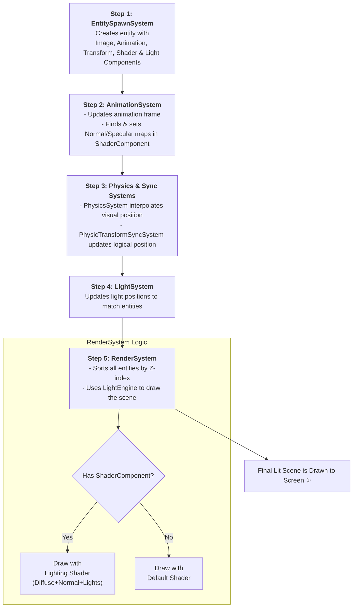

# Graphics, Animation, and Lighting Pipeline

This document outlines the architecture of the game's rendering pipeline. The system is designed to handle complex scenes with animated characters, normal and specular mapping for realistic lighting, and dynamic light sources, all integrated within the Fleks ECS framework.

The core of the system is the `RenderSystem`, which orchestrates the final drawing process, but it relies on several other systems to prepare the data for each frame.

-----

### Step 1: Spawning & Configuration (`EntitySpawnSystem.kt`)

Every visual object in the game world starts as an entity created by the `EntitySpawnSystem`. This system reads data from the game map or other sources and constructs entities by adding a specific set of components.

1.  **Entity Creation**: Entities are typically spawned based on `MapObject` definitions from a Tiled map.
2.  **Configuration (`SpawnCfg`)**: A `SpawnCfg` object provides a template for creating a specific type of entity (e.g., "playerStart", "enemy").
3.  **Core Visual Components**:
    * `ImageComponent`: Holds the `Image` actor that will be drawn on the stage. It also defines the entity's size, scale, and Z-index for layering.
    * `AnimationComponent`: Manages the entity's current animation state, including the active animation, playback mode, and speed.
    * `TransformComponent`: Stores the entity's logical position and dimensions, which are synced with the physics system.
    * `PhysicComponent`: A Box2D body that gives the entity a physical presence in the world.
    * `ShaderRenderingComponent`: An empty component that acts as a flag for the `RenderSystem`. When present, it will be populated with texture regions for diffuse, normal, and specular maps, enabling advanced lighting effects.
    * `LightComponent`: Attaches a `GameLight` (e.g., a `PointLight` or `SpotLight`) from the `gdx-normal-light` engine to the entity.

**Example from `main/kotlin/io/bennyoe/systems/EntitySpawnSystem.kt`:**

```kotlin
// In the createEntity function...
world.entity {
    // ... add ImageComponent, PhysicComponent, etc.
    
    // Add an animation manager
    val animation = AnimationComponent()
    animation.animationModel = cfg.animationModel
    it += animation

    // Enable advanced rendering by adding this component
    it += ShaderRenderingComponent()

    // Attach a light source
    it += LightComponent(the_light_object)
}
```

-----

### Step 2: The Animation System (`AnimationSystem.kt`)

This system is responsible for bringing entities to life by updating their animations every frame.

1.  **Frame Advancement**: It iterates through all entities with an `AnimationComponent` and `ImageComponent`. It advances the animation `stateTime` based on the frame `deltaTime`.
2.  **Texture Update**: It retrieves the correct `TextureRegionDrawable` for the current `stateTime` from a cached `Animation` object. This drawable is then assigned to the entity's `ImageComponent`, updating what is about to be rendered.
3.  **Normal & Specular Mapping**: This is a critical step for lighting. If the entity has a `ShaderRenderingComponent`, the `AnimationSystem` performs an additional lookup. Based on the file name and index of the current diffuse (color) texture, it finds the corresponding normal map and specular map textures in separate `TextureAtlas` files. These texture regions are then stored in the `ShaderRenderingComponent` for the `RenderSystem` to use.

-----

### Step 3: Physics & Transform Sync

To ensure visuals and physics are perfectly aligned, two systems work together.

1.  **`PhysicsSystem.kt`**: This system advances the Box2D physics world. For rendering, its most important job is in the `onAlphaEntity` method, where it **interpolates** the visual position of the `ImageComponent` between its position in the previous physics step and the current one. This prevents visual stuttering.
2.  **`PhysicTransformSyncSystem.kt`**: After the physics step is complete, this system updates the logical `TransformComponent` with the new, final position from the `PhysicComponent`'s body. This ensures other systems have access to the most up-to-date logical position.

-----

### Step 4: The Lighting System (`LightSystem.kt` & `PlayerLightSystem.kt`)

This system manages the dynamic lights in the scene.

1.  **Light Positioning (`LightSystem`)**: Iterates over entities with a `LightComponent` and `PhysicComponent`. It updates the position of the attached light source to match the entity's physics body position every frame.
2.  **Player-Specific Logic (`PlayerLightSystem`)**: This is a specialized system that handles the player's flashlight. It checks the player's `flipImage` property and adjusts the `SpotLight`'s direction accordingly, so the light always points where the player is facing.

-----

### Step 5: The Rendering System (`RenderSystem.kt`)

This is the final and most complex system in the pipeline, responsible for drawing everything to the screen.

1.  **Z-Sorting**: Before drawing, the system sorts all renderable actors on the stage based on their Z-index. This ensures that objects in the background are drawn before objects in the foreground.
2.  **Dual Rendering Paths**: The system chooses one of two paths based on whether lighting is enabled:
    * **Default Path (No Lighting)**: If lighting is disabled, it simply calls `stage.draw()`, rendering all actors in their sorted order.
    * **Lighting Path (`isLightingEnabled = true`)**: This path uses the `Scene2dLightEngine`. The engine takes control of the `SpriteBatch` and activates its own lighting shaders. The `RenderSystem` then iterates through the sorted list of renderable entities:
        * **For entities with advanced shaders** (i.e., they have a populated `ShaderRenderingComponent`), it calls a special `lightEngine.draw()` method, passing the diffuse, normal, and specular textures. The engine's shader combines these textures with the scene's light information to produce a lit, textured, and shadowed sprite.
        * **For standard entities or particles**, the `RenderSystem` flushes the batch, switches to a default shader, and draws the objects normally without advanced lighting calculations. This shader management is crucial for performance.

-----

### Graphics Pipeline Diagram


